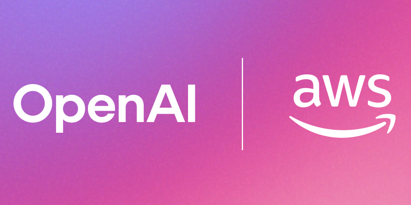

## Sample-OpenAI-on-AWS

Welcome to the Sample OpenAI-on-AWS repository! This collection provides practical examples and tutorials for running oss OpenAI models on AWS infrastructure.

### 🚀 Getting Started

Start with our foundational notebooks:

- [Getting Started with GPT-OSS models on Bedrock](https://github.com/aws-samples/sample-openai-on-aws/blob/main/Bedrock/Getting_Started_Guide_Bedrock.ipynb) 🧠 
Walks through using GPT-OSS models on Amazon Bedrock with both the Converse and InvokeModel APIs. It also shows how to instantiate and call these models via the OpenAI Chat Completions API, and explains how those calls map to Bedrock’s InvokeModel payloads

- [Deploying GPT-OSS models as Inference Components on SageMaker]((https://github.com/aws-samples/sample-openai-on-aws/blob/main/SageMaker/Inference/OpenAI-OSS-IC-EXA-sample.ipynb)) 🪼
Demonstrates deploying the GPT-OSS models on Amazon SageMaker JumpStart using Inference Components (ICs). ICs let you host multiple copies of a model—or different models—behind a single endpoint and route traffic to specific components. We also provide a deep dive on the Harmony training/formatting schema, show built-in tool use with Exa, and illustrate how to integrate external functions with this format.

- [Use OpenAI OSS models on Amazon Bedrock with LangChain](https://github.com/aws-samples/sample-openai-on-aws/blob/main/Bedrock/agentic_workflow_with_langchain.ipynb)
In this notebook, you learn how you can use OpenAI OSS models from Bedrock with Langchain.

### 🤝 Contributing

We're actively looking for contributors! Whether you're interested in:

- Adding new examples and tutorials
- Improving existing notebooks
- Documentation enhancements
- Bug fixes and optimizations
- Sharing your own use cases

## Security

See [CONTRIBUTING](CONTRIBUTING.md#security-issue-notifications) for more information.

## License

This library is licensed under the MIT-0 License. See the LICENSE file.

