In this lab, you will learn how to roll out Codex across a team with reusable guidance, safe defaults, visibility, and governance. Start with the team practices below, then add the CloudWatch and OpenTelemetry monitoring that fits teams running Codex on Amazon Bedrock.

:::alert{type=info header="Production deployments"}
For production deployments, consider implementing comprehensive monitoring solutions that integrate with your existing AWS infrastructure using CloudWatch, CloudTrail, and custom dashboards.
:::

## 1. App-first rollout maturity for teams

Teams usually get the most value by standardizing the work before they standardize dashboards. Start with shared instructions and validation habits, then add integrations and monitoring as adoption grows.

```mermaid
graph LR
    A["<b>Codex App</b><br/>default workshop surface"]
    B["<b>AGENTS.md</b><br/>repo standards and gotchas"]
    C["<b>Skills</b><br/>repeatable team workflows"]
    D["<b>Rules</b><br/>safe command approvals"]
    E["<b>Apps and MCP</b><br/>approved integrations"]
    F["<b>Telemetry</b><br/>usage, cost, and quality signals"]

    A --> B --> C --> D --> E --> F

    style A fill:#fff,stroke:#000,stroke-width:2px
    style B fill:#e3f2fd,stroke:#000,stroke-width:2px
    style C fill:#e3f2fd,stroke:#000,stroke-width:2px
    style D fill:#e3f2fd,stroke:#000,stroke-width:2px
    style E fill:#e3f2fd,stroke:#000,stroke-width:2px
    style F fill:#e3f2fd,stroke:#000,stroke-width:2px
```

## 2. Monitoring maturity for Bedrock-hosted teams

Teams running Codex through Amazon Bedrock can adopt monitoring capabilities incrementally, starting with basic CloudWatch metrics and progressively adding more sophisticated features as needs grow:

```mermaid
graph LR
    A["<b>CloudWatch</b><br/>basic, automatic, no setup"]

    subgraph enhancements["Enhanced monitoring capabilities"]
        B["<b>Invocation logging</b><br/>enable logging"]
        C["<b>OpenTelemetry</b><br/>deploy collector"]
        D["<b>Dashboard</b><br/>included with OTel"]
        E["<b>Analytics</b><br/>add data lake"]
        F["<b>Quotas</b><br/>add quota tracking"]

        B -->|adds user<br/>attribution<br/>+ code metrics| C
        C -->|adds real-time<br/>visualization| D
        D -->|adds historical<br/>SQL queries| E
        E -->|adds usage<br/>enforcement| F
    end

    A -->|adds detailed<br/>audit trails| B

    style A fill:#fff,stroke:#000,stroke-width:2px
    style B fill:#e3f2fd,stroke:#000,stroke-width:2px
    style C fill:#e3f2fd,stroke:#000,stroke-width:2px
    style D fill:#e3f2fd,stroke:#000,stroke-width:2px
    style E fill:#e3f2fd,stroke:#000,stroke-width:2px
    style F fill:#e3f2fd,stroke:#000,stroke-width:2px
    style enhancements fill:none,stroke:#666,stroke-width:2px,stroke-dasharray: 5 5
```

For Bedrock-hosted deployments, start simple: Begin with CloudWatch's automatic metrics, then enable [model invocation logging](https://docs.aws.amazon.com/bedrock/latest/userguide/model-invocation-logging.html) to capture the full request data, response data, and metadata associated with all Amazon Bedrock API calls for comprehensive audit trails.

## 3. Why OpenTelemetry monitoring is needed

While Amazon Bedrock provides API-level metrics, OpenTelemetry adds essential capabilities for scaled deployments:

- **Per-developer insights** - Individual user consumption, productivity metrics, and tool usage
- **Organizational context** - Department/team cost allocation and project-based tracking
- **Enhanced cost management** - Real-time projections, quota monitoring, and ROI measurement

## 4. Architecture overview

<!-- TODO: Add OpenTelemetry monitoring architecture diagram -->

The monitoring system works as follows:

1. **Codex client** sends metrics using OpenTelemetry Protocol (OTLP).
2. **OpenTelemetry Collector** processes and forwards metrics to CloudWatch.
3. **CloudWatch** stores metrics and provides dashboards for visualization.
4. *(Optional)* **Analytics pipeline** streams CloudWatch Logs to S3 for historical analysis with Athena.
5. *(Optional)* **Quota monitoring** tracks user consumption and sends SNS alerts when thresholds are exceeded.

:::alert{type=info header="Privacy-first monitoring with flexible backends"}
Design the monitoring system to collect usage metrics rather than conversation content. User attribution can work through authentication tokens. While this workshop focuses on CloudWatch, the OpenTelemetry Collector also supports Prometheus and other monitoring backends.
:::

## 5. What you'll learn

By the end of this lab, you will be able to:
- Build an App-first rollout path for Codex teams
- Create a lightweight Codex operating model with config, rules, custom agents, and AGENTS.md
- Use AGENTS.md, skills, rules, and integrations to standardize safe workflows
- Configure OpenTelemetry for Codex monitoring
- Set up metrics collection using CloudWatch
- Deploy comprehensive monitoring dashboards
- Create analytics pipelines for advanced reporting
- Implement quota monitoring and cost management
- Generate reports for organizational insights
