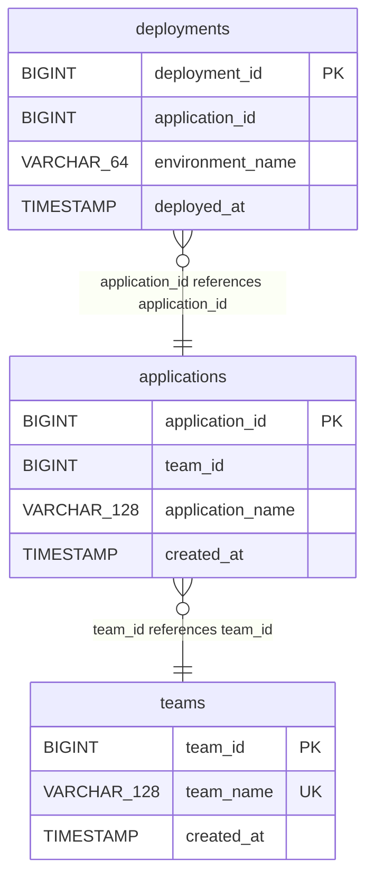

# MySQL ER Diagram - workshop

Generated: `2026-06-22T20:38:53.385881+00:00`

Scope: schema metadata only from `INFORMATION_SCHEMA`. No table row data is queried or written.

- Tables/views: 3
- Foreign keys: 2

